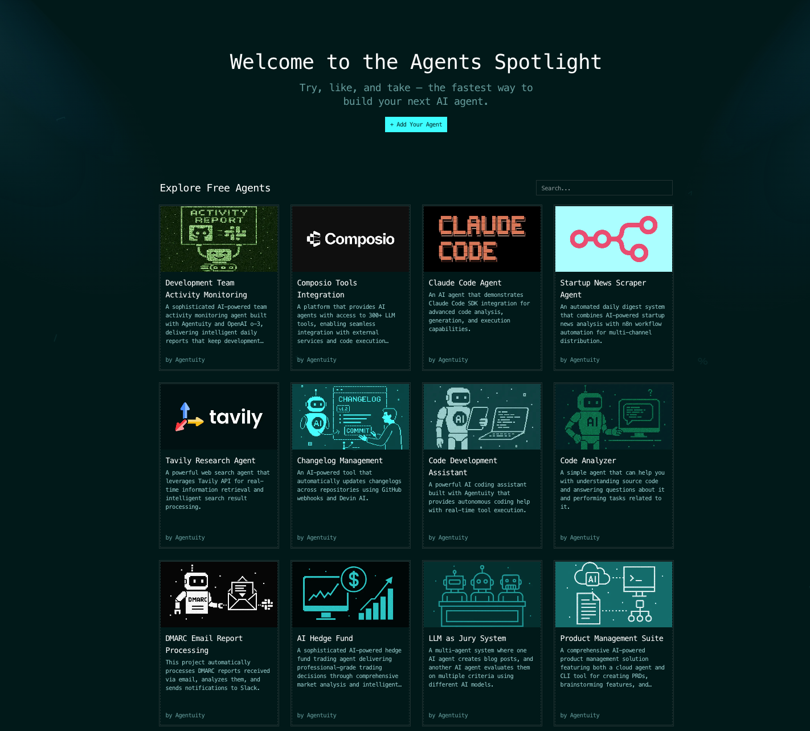

# 🚀 Agentuity Agents Spotlight - Contribution Guide 🌟

<div align="center">
  
</div>

**Want to feature your agent in the [Agentuity Spotlight](https://agentuity.com/spotlight)? You're in the right place! 🤖**

## Getting Started

We're excited to showcase your AI agents to our community! Follow this simple guide to add your agent to our spotlight.

### Creating Your Agent Spotlight

Create a new file in the `agents-spotlight/agents/` directory named `[your-agent-name].mdx`

```markdown
export const metadata = {
  title: 'Your Agent Name',
  description: 'Brief description of what your agent does',
  date: '2025-01-15',
  lastUpdatedDate: '2025-01-15',
  authorData: {
    spotlightCardName: 'Your Name',
    isCommunity: true,
    featuredAuthorName: 'Your Full Name', // optional
    featuredAuthorLink: 'https://github.com/yourusername', // optional
  },
  links: {
    repository: 'https://github.com/yourusername/your-agent-repo',
    blog: 'https://yourblog.com/agent-post', // optional
    video: 'https://youtube.com/watch?v=demo', // optional
  },
  tags: ['automation', 'productivity'], // optional
};

# Your Agent Name

## What it does

Brief overview of your agent's capabilities and purpose.

## How to use it

Step-by-step instructions on how to set up and use your agent.

## Key features

- Feature 1
- Feature 2
- Feature 3

## Demo

Include any demos, screenshots, or examples here.
```

### Contributing

1. Fork the `agents-spotlight` repository
2. Add your `[agent-name].mdx` file to the `agents/` directory
3. Add an `[agent-name].[jpg|png|webp]` image in the same directory (optional, but recommended)
4. Submit a pull request

Once your PR is approved, your agent will appear on [agentuity.com/spotlight](https://agentuity.com/spotlight) within **48 hours** automatically!

## Important Notes

### File Naming

- Use kebab-case for filenames: `my-awesome-agent.mdx`
- No spaces or special characters in filenames

### Metadata Requirements

- `title`: Keep it concise and descriptive
- `description`: 1-2 sentences explaining what the agent does
- `links.repository`: Must be a public repository link

Ready to showcase your agent? Create that PR and join the spotlight! 🚀
