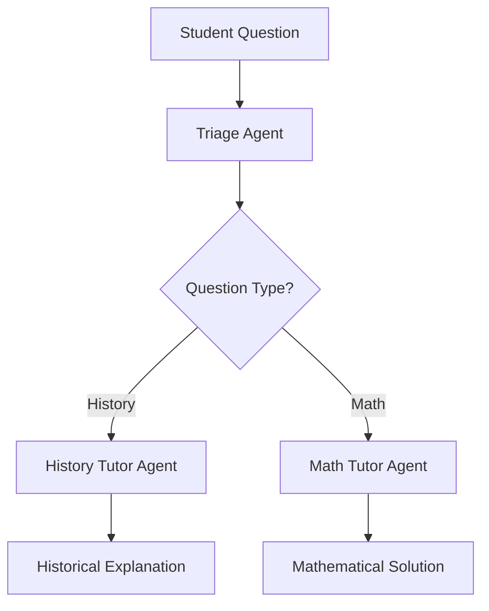

export const metadata = {
  title: 'OpenAI Tutor Agent',
  description: 'An intelligent tutoring system using OpenAI Agents framework with multi-agent handoff patterns for specialized subject matter expertise.',
  date: '2025-01-25',
  lastUpdatedDate: '2025-01-25',
  authorData: {
    spotlightCardName: 'Agentuity',
    isCommunity: true,
  },
  links: {
    repository: 'https://github.com/agentuity/examples/tree/main/frameworks/openai/from-oai-typescript',
    blog: 'https://agentuity.com/blog/openai-agents-example',
  },
  tags: ['TypeScript', 'OpenAI Agents', 'Multi-Agent System', 'Education', 'Tutoring', 'Agent Handoff', 'Math', 'History', 'Zod Validation', 'Agentuity SDK'],
};

# 🎓 OpenAI Tutor Agent

An intelligent tutoring system that demonstrates the OpenAI Agents framework with sophisticated multi-agent handoff patterns. This system routes educational questions to specialized subject matter experts for optimal learning experiences.

## ✨ Key Features

- 🤖 **Multi-Agent Architecture** - Coordinated system with specialized tutoring agents
- 🎯 **Smart Triage** - Automatically routes questions to appropriate subject experts
- 📚 **Specialized Tutors** - Dedicated agents for history and mathematics
- 🔄 **Agent Handoffs** - Seamless delegation between specialized agents
- 📖 **Educational Focus** - Explains reasoning and provides step-by-step solutions
- 🧠 **Context Preservation** - Maintains conversation context across handoffs
- 🚀 **Agentuity Native** - Built for seamless deployment on Agentuity platform

## 🏗️ Multi-Agent Architecture

### Triage Agent
The intelligent router that determines question types:
- **Question Analysis** - Analyzes incoming educational questions
- **Subject Classification** - Determines whether questions are about history or math
- **Agent Selection** - Routes to appropriate specialized tutor
- **Context Handoff** - Transfers relevant context to selected agent

### History Tutor Agent
Specialized in historical knowledge and analysis:
- **Historical Expertise** - Deep knowledge of historical events and contexts
- **Contextual Explanations** - Provides rich historical background
- **Critical Analysis** - Helps students understand cause and effect
- **Source Integration** - References historical sources and evidence

### Math Tutor Agent
Focused on mathematical problem-solving:
- **Step-by-Step Solutions** - Breaks down complex problems
- **Concept Explanation** - Explains underlying mathematical principles
- **Problem-Solving Strategies** - Teaches various solution approaches
- **Verification Methods** - Shows how to check answers

## 🛠️ Technical Implementation

### Core Technologies

- **TypeScript** - Primary development language with full type safety
- **OpenAI Agents** - Multi-agent orchestration framework
- **Zod Validation** - Runtime type validation and schema definition
- **Agentuity SDK** - Cloud-native agent platform integration

### Tutoring Workflow

1. **Question Reception** - Receives educational questions from students
2. **Intelligent Triage** - Analyzes question to determine subject area
3. **Agent Handoff** - Routes to appropriate specialized tutor agent
4. **Expert Response** - Specialized agent provides detailed explanation
5. **Context Maintenance** - Preserves conversation history and learning context

## 🚀 Quick Start with Agentuity

### Prerequisites

- **Node.js**: Version 18 or higher
- **Bun**: For package management (recommended)
- **Agentuity CLI**: Install from [agentuity.dev](https://agentuity.dev)

### Authentication

Before using Agentuity, you need to authenticate:

```bash
agentuity login
```

### Installation

Install dependencies using Bun:

```bash
bun install
```

### Development Mode

Run your project in development mode with:

```bash
agentuity dev
```

This will start your project and open a new browser window connecting your agent to the Agentuity Console in DevMode.

## 🌐 Deployment

When you're ready to deploy your agent to the Agentuity Cloud:

```bash
agentuity deploy
```

## 📚 Project Structure

```
├── src/
│   └── agents/
│       └── tutorAgent/
│           └── index.ts        # Multi-agent tutoring system
├── package.json                # Dependencies and scripts
├── tsconfig.json              # TypeScript configuration
├── agentuity.yaml             # Agentuity project configuration
└── README.md                  # Documentation
```

## 🔧 Usage Examples

### History Question

```json
{
  "message": "What caused World War I?"
}
```

**Response:**
```json
{
  "type": "completion",
  "message": "World War I was caused by a complex web of factors including...",
  "finalOutput": "Detailed historical explanation with context and key events"
}
```

### Math Question

```json
{
  "message": "Solve: 2x + 5 = 15"
}
```

**Response:**
```json
{
  "type": "completion", 
  "message": "To solve 2x + 5 = 15:\nStep 1: Subtract 5 from both sides...",
  "finalOutput": "Step-by-step solution with explanations"
}
```

## 📊 Educational Capabilities

### History Tutoring
- **Event Analysis** - Detailed examination of historical events
- **Cause and Effect** - Understanding historical relationships
- **Timeline Construction** - Chronological understanding
- **Source Evaluation** - Critical analysis of historical sources
- **Contextual Understanding** - Broader historical context

### Mathematics Tutoring
- **Problem Solving** - Step-by-step solution methods
- **Concept Explanation** - Understanding mathematical principles
- **Multiple Approaches** - Different solution strategies
- **Error Analysis** - Identifying and correcting mistakes
- **Application Examples** - Real-world mathematical applications

## 🎯 Learning Features

- **Adaptive Responses** - Tailored to student's level of understanding
- **Interactive Dialogue** - Encourages questions and clarification
- **Progressive Difficulty** - Builds complexity gradually
- **Conceptual Focus** - Emphasizes understanding over memorization
- **Encouraging Feedback** - Positive reinforcement and guidance

## 🔄 Agent Handoff Pattern

The system demonstrates sophisticated agent coordination:



## 📖 Documentation

For comprehensive documentation:
- [Agentuity JavaScript SDK](https://agentuity.dev/SDKs/javascript)
- [OpenAI Agents Examples](https://github.com/openai/openai-agents-js/tree/main/examples)
- [OpenAI Agents SDK Docs](https://openai.github.io/openai-agents-js/)

## 🆘 Troubleshooting

If you encounter any issues:

1. Check the [Agentuity Documentation](https://agentuity.dev)
2. Review [OpenAI Agents Examples](https://github.com/openai/agents)
3. Join our [Discord Community](https://discord.gg/agentuity)
4. Contact Agentuity Support

## 📝 License

This project is licensed under the terms specified in the LICENSE file.
