export const metadata = {
  title: 'Coding Agent - AI-Powered Development Assistant',
  description: 'A powerful AI coding assistant built with Agentuity that provides autonomous coding help with real-time tool execution.',
  imageURL: '/showroom-exhibit-image/coder-agent.png',
  date: '2025-01-16',
  lastUpdatedDate: '2025-01-16',
  authorData: {
    showroomCardName: 'Agentuity team',
    isCommunity: true,
    exhibitAuthorName: 'Rick Blalock',
    exhibitAuthorLink: 'https://github.com/rblalock',
  },
  links: {
    repository: 'https://github.com/agentuity/agent-coder',
    video: 'https://youtu.be/9OP6PhAhifQ'
  },
  tags: ['TypeScript', 'AI Agents', 'Code Generation', 'Development Tools', 'CLI', 'Hybrid Architecture', 'Claude', 'Riza.io', 'Bun', 'Agentuity SDK'],
};

# 🤖 Coding Agent

[](https://youtu.be/9OP6PhAhifQ)

A powerful AI coding assistant built with Agentuity that provides autonomous coding help with real-time tool execution. Features a hybrid cloud-local architecture where the AI runs in the cloud but all tool execution happens securely on your local machine.

## ✨ Features

### 🔧 Core Capabilities
- **File Operations**: Read, write, list directories, create directories
- **Code Execution**: Safe execution of Python, JavaScript, and TypeScript via Riza.io
- **Shell Commands**: Git operations, npm/bun commands, build tools (safety-checked)
- **Diff Visualization**: Beautiful file comparisons with delta integration
- **Work Context**: Remember goals and progress across sessions
- **Multi-Language Support**: Python, JavaScript, TypeScript, Go codebases

### 🏗️ Hybrid Architecture
```
┌─────────────────┐    ┌─────────────────┐    ┌─────────────────┐
│   Cloud Agent   │◄──►│   Local CLI     │◄──►│  Local Tools    │
│  (Claude LLM)   │    │ (Tool Proxy)    │    │ (File System)   │
└─────────────────┘    └─────────────────┘    └─────────────────┘
```

**Benefits:**
- 🌐 **AI in the cloud** - Access to latest Claude models and Agentuity infrastructure
- 🔒 **Tools run locally** - Your files and commands never leave your machine
- 🚀 **Works anywhere** - Same experience locally and deployed to cloud
- 🔄 **Real-time streaming** - See AI thinking and tool execution live

### 🔄 Tool Execution Flow

Here's how the hybrid architecture enables secure tool execution:

```mermaid
sequenceDiagram
    participant User
    participant CLI as CLI Client<br/>(Local)
    participant Agent as Cloud Agent<br/>(Claude LLM)
    participant Tools as Tool Proxy<br/>(Local)
    participant FS as File System<br/>(Local)

    User->>CLI: "Fix bug in main.py"
    CLI->>Agent: HTTP Request: Message + Context
    
    Note over Agent: AI analyzes request<br/>and decides tools needed
    
    Agent->>CLI: Tool Call: read_file("main.py")
    CLI->>Tools: Execute read_file locally
    Tools->>FS: Read file from disk
    FS-->>Tools: File content
    Tools-->>CLI: Tool result
    CLI->>Agent: HTTP Response: Tool result
    
    Note over Agent: AI analyzes code<br/>and determines fix
    
    Agent->>CLI: Tool Call: write_file("main.py", fixed_content)
    CLI->>Tools: Execute write_file locally
    Tools->>FS: Write modified file
    FS-->>Tools: Write confirmation
    Tools-->>CLI: Success result
    CLI->>Agent: HTTP Response: Success
    
    Note over Agent: AI prepares<br/>final response
    
    Agent-->>CLI: Final response with explanation
    CLI-->>User: Display: "✅ Fixed bug in main.py"
```



**Key Security Features:**
- 🔒 **No file access by cloud** - Files never leave your machine
- 🛡️ **Sandboxed execution** - Code runs in isolated environments (Riza.io)
- ✅ **Command whitelisting** - Only safe shell commands allowed

#### Technical Components

- **CLI Client** (`cli.js`) - Handles user interaction and streams responses
- **Continuation Handler** (`cli/continuation-handler.ts`) - Parses tool calls and manages execution flow
- **Tool Proxy** (`cli/tool-proxy.ts`) - Executes tools safely in your local environment
- **Cloud Agent** (`src/agents/CloudCoder/`) - Claude-powered AI running on Agentuity infrastructure
- **Tool Interface** (`tools/interface.ts`) - Shared schemas for tool calls and results

## 🚀 Quick Start

### 1. Setup
```bash
# Clone and install
git clone <your-repo>
cd CodingAgent
bun install

# Run setup wizard (creates global 'coder' command)
bun run setup

# Start local development server
bun run dev
```

### 2. Use the CLI
```bash
# Global command (after setup)
coder --interactive                # Interactive mode (recommended)
coder "What files are in this project?"
coder "Create a FastAPI server with authentication"

# Alternative: Development mode
bun run cli --interactive

# Local vs Cloud modes
coder --local "analyze this codebase"
coder --cloud "help with debugging"  # (when cloud configured)
```

### 3. Example Session
```bash
$ coder --interactive

   ___          _  _                 _                    _
  / __| ___  __| |(_) _ _   __ _    /_\   __ _  ___  _ _ | |_
 | (__ / _ \/ _` || || ' \ / _` |  / _ \ / _` |/ -_)| ' \|  _|
  \___|\___/\__,_||_||_||_|\__, | /_/ \_\\__, |\___||_||_|\__|
                           |___/         |___/

💬 You: What does this project do?

🤖 Agent: I'll analyze the project structure to understand what it does.
🔧 Using tool: list_directory

[Tool executes locally, returns results]

This is a Coding Agent built with Agentuity that provides AI-powered 
coding assistance. It features a hybrid architecture where...
```

## 🎨 CLI Features

### 🔧 Interactive Commands
- `/help` - Show available commands and examples
- `/clear` - Clear screen and show header  
- `/session` - Start new conversation session
- `/context` - Show current work context and goals
- `/diff` - Show git diff with beautiful formatting
- `/quit` - Exit gracefully

### 🎯 Smart Features
- **Project Detection** - Auto-detects git repos, package.json, pyproject.toml
- **Session Persistence** - Maintains conversation context across interactions
- **Beautiful Output** - Colored text, loading spinners, progress indicators
- **Command History** - Remembers your previous interactions

## 🛠️ Available Tools

The agent has access to these tools that run on your local machine:

| Tool | Description | Example Usage |
|------|-------------|---------------|
| **read_file** | Read and examine code files | "Show me the main.py file" |
| **write_file** | Create or modify files | "Create a FastAPI server" |
| **list_directory** | Explore project structure | "What files are in src/?" |
| **create_directory** | Create new directories | "Organize code into modules" |
| **execute_code** | Run code safely (Python/JS/TS) | "Test this function" |
| **run_command** | Execute shell commands | "Run the tests", "git status" |
| **diff_files** | Compare file versions | "Show changes in main.py" |
| **git_diff** | Beautiful git diffs | "What changed since last commit?" |
| **set_work_context** | Set current goals | "We're building user auth" |
| **get_work_context** | Check current work | "What are we working on?" |

## ⚙️ Configuration

### Environment Variables
```bash
# Required
API_KEY=your_agentuity_api_key

# Optional (for code execution)
RIZA_API_KEY=your_riza_api_key

# Optional (override agent URL)
AGENT_URL=https://your-custom-agent.agentuity.cloud/agent_xxx
```

### Agent URLs (Auto-detected)
The CLI automatically detects your agent URLs using `agentuity agent list --format json`. This means the system works out-of-the-box for any developer who clones the repo.

**Local Development:**
- Runs agent on `http://127.0.0.1:3500/agent_xxx`
- All tools execute on your local machine

**Cloud Deployment:**
- Agent runs on `https://your-deployment.agentuity.cloud/agent_xxx`
- Tools still execute locally via CLI

## 🔧 Development

### Project Structure
```
CodingAgent/
├── src/agents/CloudCoder/     # Main agent (works local + cloud)
├── cli/                       # CLI client and tool proxy
│   ├── continuation-handler.ts
│   ├── tool-proxy.ts
│   └── config-utils.ts
├── tools/                     # Shared tool definitions
├── scripts/                   # Utility scripts
├── cli.js                     # Main CLI entry point
└── agentuity.yaml            # Agent configuration
```

### Development Commands
```bash
# Start development server
bun run dev

# Use CLI locally
bun run cli --local --interactive

# Test dynamic configuration
bun run test-config

# Show detected agent URLs
bun run show-urls

# Format and lint
bun run format
bun run lint
```

### Testing
```bash
# Test local agent
bun run cli --local "test message"

# Test configuration detection
bun run test-config

# Test specific functionality
bun run cli --local "run git status"
bun run cli --local "list files and create a simple test"
```

## 🚦 Usage Examples

### File Operations
```bash
💬 You: "What's in package.json and what dependencies do we have?"
# Agent reads file and analyzes dependencies

💬 You: "Create a simple Express server in server.js"
# Agent writes file and explains the code

💬 You: "Show me the project structure"  
# Agent lists directories and key files
```

### Code Development
```bash
💬 You: "Create a Python function to calculate fibonacci numbers"
# Agent writes fibonacci.py and tests it with execute_code

💬 You: "Fix the bug in src/main.py line 42"
# Agent reads file, identifies issue, makes fix, shows diff

💬 You: "Run the tests and show me any failures"
# Agent runs npm test and analyzes output
```

### Git & Project Management
```bash
💬 You: "What changed since my last commit?"
# Agent runs git diff with beautiful formatting

💬 You: "We're working on user authentication - set that as our context"
# Agent remembers this goal for the session

💬 You: "What are we currently working on?"
# Agent shows current work context and progress
```

## 🔒 Security

- **Sandboxed Code Execution**: All code runs in Riza.io isolated environments
- **Local Tool Execution**: Files and commands never leave your machine
- **Command Safety**: Shell commands are whitelisted and checked
- **No Hardcoded Secrets**: All API keys via environment variables
- **Session Isolation**: Each conversation has its own secure context

## 🎯 CLI Modes

### Local Mode (Default)
```bash
bun run cli --local "message"
```
- Agent runs on `localhost:3500`
- Great for development and testing
- No internet required (except for AI model calls)

### Cloud Mode
```bash
bun run cli --cloud "message"  
```
- Agent runs on Agentuity cloud
- Perfect for team collaboration
- Same local tool execution

### Auto Mode
```bash
bun run cli "message"  # defaults to local
```
- Automatically chooses best available mode
- Falls back gracefully if one mode unavailable

## 🚀 Distribution

This coding agent is designed to be easily shared and used by any developer:

1. **Clone & Go**: Works immediately after `git clone` + `bun install`
2. **Dynamic Configuration**: Auto-detects any developer's agent IDs
3. **Zero Config**: No setup required for basic local usage
4. **Portable**: Same experience on any machine

### For Teams
1. Deploy agent to Agentuity cloud
2. Share cloud URL with team
3. Everyone uses same `--cloud` mode
4. All tool execution remains local for each developer

## 🐛 Troubleshooting

### Common Issues

**"Failed to communicate with agent"**
- Check if `bun run dev` is running for local mode
- Verify `API_KEY` environment variable is set
- Try `bun run test-config` to check configuration

**"Code execution failed"**
- Set `RIZA_API_KEY` environment variable
- Check code syntax and language support
- Verify network access to Riza.io

**"Command not allowed"**
- Shell commands are safety-checked
- Use allowed commands: git, npm, bun, python, node, etc.
- Check command whitelist in tool configuration

### Debug Commands
```bash
# Test configuration
bun run test-config

# Check agent URLs
bun run show-urls

# Test with simple message
bun run cli --local "hello"
```

## 🤝 Contributing

1. **Fork & Clone**: Standard GitHub workflow
2. **Local Development**: Use `bun run dev` + `bun run cli --local`
3. **Add Tools**: Extend `tools/interface.ts` for new capabilities
4. **Test**: Verify both local and cloud modes work
5. **Document**: Update this README for new features

## 📚 Advanced Usage

### Custom Agent URLs
```bash
export AGENT_URL="https://custom-agent.example.com/agent_xxx"
bun run cli "message"
```

### Session Management
```bash
# Use specific session
bun run cli --session my-project-auth "continue previous work"
```

### Integration Examples
```javascript
// Direct API usage
const response = await fetch('http://127.0.0.1:3500/agent_xxx', {
  method: 'POST',
  headers: {
    'Content-Type': 'text/plain',
    'Authorization': `Bearer ${API_KEY}`,
    'x-session-id': 'unique-session'
  },
  body: 'Your coding request here'
});
```

---

**Built with ❤️ using [Agentuity](https://agentuity.dev) and [Riza.io](https://riza.io)**
